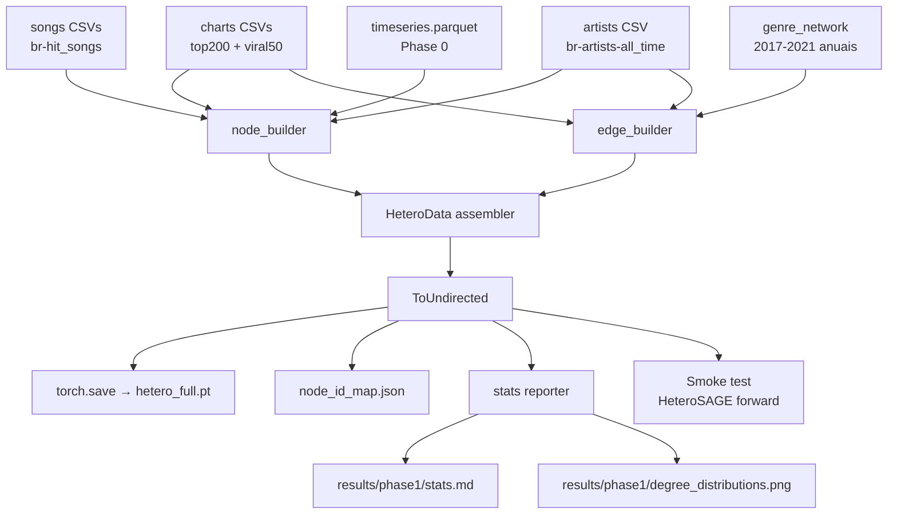

# Phase 1 — Design (Construção do grafo heterogêneo)

**Spec:** [`spec.md`](spec.md)
**Status:** Draft
**Depende de:** Phase 0 (`data/processed/subset_ids.json`, `timeseries.parquet`)
**Bloqueia:** Phase 2 (Temporal GNN)

---

## Resolução das open questions do spec

| # | Questão | Decisão | Justificativa |
|---|---------|---------|---------------|
| Q1 | Features do nó `genre` | `nn.Embedding(530, 32)` aprendido end-to-end | Denso, ~17K params, padrão em HeteroSAGE quando não há features prontas. Spec R0.3 exige apenas `(N_g, d)` com `d≥1`. |
| Q2 | Co-trajetória em ambos os charts ≥7 dias | **2 arestas paralelas** (uma por chart) | Preserva atributos específicos por chart (`days_together`, `avg_position_distance`). PyG aceita paralelas em `edge_index` nativamente. Filtro por chart no Phase 2 fica trivial. |
| Q3 | Músicas sem features acústicas MGD+ | **Imputar mediana + flag binária** `acoustic_missing` | Mantém o universo de 6.469 nós intacto (cumpre C1). Permite z-score sem NaN. Flag dá ao GNN sinal de incerteza. Spec R0.5 já autoriza ("flag de imputação opcional"). |
| Q4 | Direção `has_genre` | `ToUndirected()` do PyG | Cria automaticamente `(genre, rev_has_genre, artist)`. HeteroSAGE/HGT esperam pares ordenados; o transform garante consistência. |
| Q5 | Pretrain do embedding de gênero | **Inicialização aleatória** (normal_) | 530 nós + supervisão do Phase 2 são suficientes. Pretrain node2vec adicionaria dep e overhead sem ganho claro. Mantido como Plano B se a base não convergir. |

---

## Architecture Overview

Pipeline single-shot, determinístico, ~10 min em laptop. Lê os CSVs MGD+ + parquet do Phase 0, constrói nós e arestas com `first_seen_week`, serializa um único `HeteroData` + relatório de estatísticas. **Não materializa snapshots em disco** — visão temporal é função pura (`mask_until`).



**Princípios:**
- Cada *builder* (node/edge) retorna `dict[str, Tensor]` + mapping `id → index`. Idempotente, testável isoladamente.
- `HeteroData` é montado **uma vez** no orquestrador (`build.py`). Builders não tocam em PyG.
- `ToUndirected()` aplicado apenas a `has_genre` e `cooccurs` (não a `performs` nem `cotrajectory` — direcionadas).
- `first_seen_week` é coluna obrigatória em `edge_attr` de todos os tipos (R1.5).

---

## Code Reuse Analysis

### Componentes existentes a aproveitar

| Componente | Localização | Uso |
|------------|-------------|-----|
| `load_charts()` | [src/music_diffusion_gnn/data/loaders.py:13](../../../src/music_diffusion_gnn/data/loaders.py#L13) | Universo Top200 BR 2017-2021 (~6.469 song_ids) + viral50 para co-trajetória |
| `load_songs()` | [src/music_diffusion_gnn/data/loaders.py:85](../../../src/music_diffusion_gnn/data/loaders.py#L85) | 9 features acústicas + popularity + explicit + song_type por song_id |
| `load_artists()` | [src/music_diffusion_gnn/data/loaders.py:111](../../../src/music_diffusion_gnn/data/loaders.py#L111) | `artist_id`, `genres_list` (já parseado), `years_on_charts`, `num_hits`, `num_collab_hits` |
| `load_genre_network(year)` | [src/music_diffusion_gnn/data/loaders.py:120](../../../src/music_diffusion_gnn/data/loaders.py#L120) | Arestas anuais `(Source, Target, Weight, Avg_Popularity, Avg_Streams)` — usar com `year=` para extrair `first_seen_week` |
| `load_subset()` | [src/music_diffusion_gnn/data/subset.py:58](../../../src/music_diffusion_gnn/data/subset.py#L58) | Verificar C4 (todas as 1.981 do viral∩hit estão no grafo) |
| `timeseries.parquet` | `data/processed/` (Phase 0) | Derivar `total_streams` e `dias_no_chart` por song_id sem reler charts brutos |

### Integration points

| Sistema | Forma |
|---------|-------|
| Phase 0 (`subset_ids.json`, `timeseries.parquet`) | Leitura via `load_subset()` + `pd.read_parquet`. Sem modificação. |
| Phase 2 (Temporal GNN) | Consome `hetero_full.pt` + `mask_until(g, w)`. Phase 2 escolhe `w` por split. |
| `pyproject.toml` | Adicionar `python-louvain>=0.16` (Louvain para R3.3); torch/networkx já presentes. |

### Caveats observados no código

- `loaders.py` aponta para `DATA / "charts" / "mgdplus"` e `DATA / "songs"`, mas o repo tem os arquivos em `data/MGDplus/charts/regional/` e `data/MGDplus/songs/regional/`. Funciona em Phase 0 porque o parquet cacheado evita reler. **Fase 1 vai precisar reler os charts brutos** (universo Top200 completo, não só subset). Plano: passar `path=` explícito nos calls, sem refatorar `loaders.py` agora. Adicionar nota no STATE.md como dívida técnica.

---

## Components

### `graph.nodes` — `src/music_diffusion_gnn/graph/nodes.py`

- **Purpose:** Construir features e id-maps para os 3 tipos de nó.
- **Interfaces:**
  - `build_music_nodes(charts_df, songs_df, timeseries_df) -> tuple[Tensor, dict[str,int]]`
    - Retorna `x_music` shape `(N_m, 14)` float32 normalizada + map `song_id → idx`.
    - Colunas: 9 acústicas + popularity + explicit + song_type + total_streams + dias_no_chart + `acoustic_missing`. (15 colunas)
    - **Correção vs spec R0.1:** spec lista 14 mas inclui `acoustic_missing` opcional → 15 com flag.
    - Imputação: mediana por coluna acústica; `acoustic_missing=1` se MGD+ não tinha entrada.
    - Normalização: z-score por coluna contínua, calculada **antes** da imputação para não enviesar.
  - `build_artist_nodes(artists_df, music_id_map, charts_df) -> tuple[Tensor, dict[str,int]]`
    - Retorna `x_artist` shape `(N_a, 4)` + map `artist_id → idx`.
    - Colunas: `num_hits`, `num_collab_hits`, `years_on_charts`, `n_genres` (todas z-score).
    - Filtro: apenas artistas com ≥1 música no universo de 6.469 (esperado ~1.701).
  - `build_genre_nodes(artists_df) -> tuple[Tensor, dict[str,int]]`
    - Retorna `x_genre` shape `(N_g, 32)` inicializado com `torch.empty(N_g, 32).normal_(0, 0.1)` + map `genre_name → idx`.
    - Universo: união de `genres_list` em artistas filtrados (esperado ~530).
- **Dependencies:** pandas, torch, scipy.stats (z-score).
- **Reuses:** `load_charts/songs/artists` de [loaders.py](../../../src/music_diffusion_gnn/data/loaders.py).

### `graph.edges` — `src/music_diffusion_gnn/graph/edges.py`

- **Purpose:** Construir `edge_index` + `edge_attr` para os 4 tipos de aresta com `first_seen_week`.
- **Interfaces:**
  - `build_performs(charts_df, songs_df, music_id_map, artist_id_map) -> EdgeData`
    - `(artist, performs, music)` direcionada. Atributos: `role ∈ {0=main,1=feat}` (int), `position_in_list` (int), `first_seen_week` (int = semana da primeira aparição da música no chart).
    - Fonte: coluna `artists_id` em `br-hit_songs-*.csv` (lista ordenada).
  - `build_has_genre(artists_df, artist_id_map, genre_id_map) -> EdgeData`
    - `(artist, has_genre, genre)` direcionada (ToUndirected aplica reverso depois). Sem features.
    - `first_seen_week = 0` (ausência de info temporal de filiação; tratado como pré-existente).
  - `build_cotrajectory(charts_df, music_id_map) -> EdgeData`
    - `(music, cotrajectory, music)` direcionada. **2 arestas paralelas se par coexistiu em ambos os charts.**
    - Atributos: `days_together` (int ≥7), `avg_position_distance` (float), `chart` (int: 0=viral50, 1=top200), `first_seen_week` (int = semana em que o par ficou elegível, i.e., 7º dia consecutivo de coexistência).
    - Algoritmo: para cada chart C, agrupar (song_id, date) → conjunto. Para cada par (i,j) com `i ≠ j`, contar dias em comum. Se ≥7, criar aresta `i→j` se primeira data de i no chart C < primeira data de j; caso contrário `j→i`. Empate: ordem lexicográfica do song_id (determinístico).
    - **Custo computacional:** ~6.469² ≈ 42M pares no pior caso. Mitigação: agregar por (chart, date) → set de song_ids, depois iterar pares (song_i, song_j) **apenas dentro do mesmo dia**, acumular dias em dict. Mantém complexidade ~Σ_d |C_d|² ≈ 260 dias × 200² = 10M ops, viável.
  - `build_cooccurs(genre_id_map, year_range=(2017,2021)) -> EdgeData`
    - `(genre, cooccurs, genre)` direcionada (ToUndirected depois). Atributos: `weight`, `avg_popularity`, `avg_streams`, `first_seen_week`.
    - Algoritmo: para cada ano y em [2017..2021], carregar `br-genre_network-{y}.csv` → para cada (Source, Target) novo (não visto em ano anterior), `first_seen_week = (y - 2017) * 52` (proxy semana-1 do ano). Para arestas reincidentes, manter `first_seen_week` da primeira aparição; atualizar `weight/avg_popularity/avg_streams` com o **valor do ano mais recente** (snapshot final, mantém atributos consistentes com a última observação).
- **Dependencies:** pandas, torch, collections.defaultdict.
- **Reuses:** `load_charts`, `load_artists`, `load_genre_network`.

### `graph.temporal` — `src/music_diffusion_gnn/graph/temporal.py`

- **Purpose:** Calendário canônico + máscara temporal sem leakage.
- **Interfaces:**
  - `week_index(d: date | str) -> int` — retorna `(ISO_year, ISO_week)` projetado em offset linear: `(year - 2017) * 52 + (week - 1)`. Range esperado: `[0, 260]`. Levanta `ValueError` se fora.
  - `mask_until(hetero: HeteroData, week_t: int) -> HeteroData` — retorna **clone raso** (compartilha tensores de feature) com `edge_index` e `edge_attr` filtrados onde `first_seen_week ≤ week_t`. Implementação: para cada `edge_type`, `mask = g[et].first_seen_week <= week_t; g_new[et].edge_index = g[et].edge_index[:, mask]; ...`.
- **Dependencies:** torch, torch_geometric, datetime, isocalendar.
- **Reuses:** nenhum.

### `graph.build` — `src/music_diffusion_gnn/graph/build.py`

- **Purpose:** Orquestrador. Monta `HeteroData`, aplica `ToUndirected` seletivo, serializa.
- **Interfaces:**
  - `build_hetero(out_dir: Path = data/processed/graph) -> HeteroData` — pipeline completo.
    1. Carrega charts, songs, artists, genre_network, timeseries.
    2. Chama `nodes.build_music/artist/genre_nodes`.
    3. Chama `edges.build_performs/has_genre/cotrajectory/cooccurs`.
    4. Monta `HeteroData`:
       ```
       g['music'].x = x_music; g['artist'].x = x_artist; g['genre'].x = x_genre
       g['artist','performs','music'].edge_index = ...; .edge_attr = ...
       g['artist','has_genre','genre'].edge_index = ...
       g['music','cotrajectory','music'].edge_index = ...; .edge_attr = ...
       g['genre','cooccurs','genre'].edge_index = ...; .edge_attr = ...
       ```
    5. Aplica `ToUndirected(merge=False)` **apenas** sobre `has_genre` e `cooccurs` (estratégia: monta dois HeteroData parciais ou usa `T.ToUndirected` com filtro manual).
    6. Valida invariants (C1-C7 do spec).
    7. Persiste `hetero_full.pt` + `node_id_map.json`.
- **Dependencies:** torch_geometric.data, torch_geometric.transforms.
- **Reuses:** todos os módulos acima.

### `graph.stats` — `src/music_diffusion_gnn/graph/stats.py`

- **Purpose:** Gerar `results/phase1/stats.md` + `degree_distributions.png`.
- **Interfaces:**
  - `compute_stats(hetero: HeteroData) -> dict` — retorna dict com: contagens; grau (mean/median/p95/max) por (tipo_nó, tipo_aresta); n_componentes por subgrafo homogêneo (via `networkx.connected_components` em projeção homogênea de cada edge_type); clustering coefficient médio por tipo de nó; top-10 comunidades Louvain no subgrafo `(genre, cooccurs, genre)`.
  - `render_report(stats: dict, out_md: Path) -> None`
  - `plot_degree_distributions(hetero: HeteroData, out_png: Path) -> None` — 4 painéis matplotlib (um por edge_type), eixo log-log.
- **Dependencies:** networkx, python-louvain (community), matplotlib, seaborn.
- **Reuses:** nenhum.

### `scripts/run_phase1.py` — entrypoint

- **Purpose:** CLI reproducível (`python scripts/run_phase1.py`).
- **Comportamento:** chama `build.build_hetero()` → `stats.compute_stats + render_report + plot_*` → smoke-test `HeteroSAGE(2 camadas, hidden=128)` forward em CPU → imprime checklist C1-C9 colorido + exit code 0/1.
- **Dependencies:** todos os módulos `graph/*`.

---

## Data Models

### `HeteroData` schema final (após `ToUndirected`)

```python
HeteroData(
    music={ 'x': Tensor(6469, 15), 'song_id': List[str] },
    artist={ 'x': Tensor(1701, 4),  'artist_id': List[str] },
    genre={ 'x': Tensor(530, 32),   'genre_name': List[str] },

    ('artist', 'performs', 'music')={
        'edge_index': LongTensor(2, E_perf),
        'edge_attr': Tensor(E_perf, 3),  # [role, position_in_list, first_seen_week]
    },
    ('artist', 'has_genre', 'genre')={
        'edge_index': LongTensor(2, E_hg),
        'first_seen_week': Tensor(E_hg,),  # = 0 para todos
    },
    ('genre', 'rev_has_genre', 'artist')={  # criado por ToUndirected
        'edge_index': LongTensor(2, E_hg),
        'first_seen_week': Tensor(E_hg,),
    },
    ('music', 'cotrajectory', 'music')={
        'edge_index': LongTensor(2, E_co),
        'edge_attr': Tensor(E_co, 4),  # [days_together, avg_position_distance, chart, first_seen_week]
    },
    ('genre', 'cooccurs', 'genre')={
        'edge_index': LongTensor(2, E_cog),
        'edge_attr': Tensor(E_cog, 4),  # [weight, avg_popularity, avg_streams, first_seen_week]
    },
    # ToUndirected também espelha cooccurs (cria rev) — opcional; alternativa: já construir simétrico.
)
```

**Decisão sobre `first_seen_week` em `edge_attr`:** mantido como **última coluna** de `edge_attr` em todas as arestas com features, ou como tensor separado `.first_seen_week` para `has_genre` (sem features). `mask_until` deve aceitar ambos os layouts; convenção: se `edge_attr` existe, `first_seen_week = edge_attr[:, -1]`; senão, `.first_seen_week`.

### `node_id_map.json`

```json
{
  "music":  { "spotify_id_to_idx": {"5xy...": 0, ...}, "idx_to_spotify_id": ["5xy...", ...] },
  "artist": { "artist_id_to_idx": {...}, "idx_to_artist_id": [...] },
  "genre":  { "genre_name_to_idx": {...}, "idx_to_genre_name": [...] }
}
```

---

## Error Handling Strategy

| Cenário | Tratamento | Impacto |
|---------|------------|---------|
| MGD+ song_id sem entrada em songs_df | `acoustic_missing=1` + imputar mediana | Nó incluído, GNN sabe da incerteza. |
| Artista referenciado em `artists_id` de uma música mas ausente em `br-artists-all_time.csv` | Log warning + criar nó artista com features zeradas + flag (não modelada no v1; aceitar perda) | Aresta `performs` criada mesmo assim. Esperado <1%. |
| Gênero presente em `artists.genres_list` mas ausente em `genre_network` (nenhuma co-ocorrência) | Criar nó genre (embedding aprende), sem arestas `cooccurs` | Esperado para gêneros muito raros; OK. |
| `first_seen_week > 260` por bug de parsing | Levantar `ValueError` em `week_index` | Falha fast no build, antes de serializar. |
| `mask_until(g, w)` com `w < 0` ou `w > 260` | `ValueError` | Erro programador, não silencioso. |
| Smoke-test `HeteroSAGE` falha forward | `run_phase1.py` exit code 1 + stack trace | C8 reprova → não pode mergear. |
| Contagens fora da tolerância C1-C3 | Print red ✘ + exit code 1 | Bloqueia merge. |
| Arquivo de saída já existe | Sobrescrever (build é determinístico) | Reproducibilidade R5.2. |

---

## Tech Decisions (não-óbvias)

| Decisão | Escolha | Racional |
|---------|---------|----------|
| Materialização de snapshots | Não materializar; só `mask_until` em runtime | 260 snapshots × ~MB cada = GB no disco; máscara é O(E) tensor op |
| `ToUndirected` aplicação | Seletiva (apenas `has_genre`, `cooccurs`) | `performs` e `cotrajectory` são semânticamente direcionadas |
| Co-trajetória em ambos charts | 2 arestas paralelas | Preserva atributos por chart; PyG aceita; filtro no Phase 2 trivial |
| Genre features | Embedding 32-d aleatório aprendido | Mais denso que one-hot 530-d, menos overhead que node2vec pretrain |
| Acoustic missing | Imputar mediana + flag binária | Mantém universo 6.469 (C1) sem propagar NaN no z-score |
| `first_seen_week` de `cooccurs` | Primeira aparição em `br-genre_network-{year}.csv`, semana = (year-2017)*52 | MGD+ é anual; semana-1 do ano é proxy razoável |
| Atributos `cooccurs` em arestas reincidentes | Snapshot do ano mais recente | Mantém consistência com observação final; alternativa (média) suaviza demais |
| Empate na direção `cotrajectory` (i e j entram no mesmo dia) | Ordem lexicográfica do song_id | Determinismo (R5.2) |
| `python-louvain` | Adicionar à `pyproject.toml` | Necessário para R3.3; alternativa `networkx.community.louvain_communities` existe a partir de networkx≥3.1 ✓ — **revisar**: usar nativo `nx.community.louvain_communities`, evitar dep nova |
| Smoke-test HeteroSAGE | 2 camadas, hidden=128, sem treino | Apenas valida que o grafo é consumível pelo PyG (C8); Phase 2 faz o real |

**Revisão python-louvain:** `networkx>=3.1` já tem `nx.community.louvain_communities`. Decisão final: **usar nativo do networkx, não adicionar dep**.

---

## Validação dos critérios (C1-C9) no build

| Critério | Onde valida | Como |
|----------|-------------|------|
| C1 (n_music=6469±10) | `build.build_hetero` pós-assembly | `assert abs(g['music'].num_nodes - 6469) <= 10` |
| C2 (n_artist=1701±5) | idem | `assert abs(g['artist'].num_nodes - 1701) <= 5` |
| C3 (n_genre=530±10) | idem | idem |
| C4 (1.981 subset ⊆ music) | idem | `subset = load_subset(); assert all(s in id_map['music'] for s in subset)` |
| C5 (artistas das subset alcançáveis) | idem | BFS em `performs` desde nós do subset |
| C6 (arestas → nós válidos) | idem | `assert g[et].edge_index[0].max() < N_src and g[et].edge_index[1].max() < N_dst` |
| C7 (`first_seen_week ∈ [0,260]`) | idem | `assert (g[et].first_seen_week >= 0).all() and (... <= 260).all()` por edge_type |
| C8 (HeteroSAGE forward) | `run_phase1.py` final | `model = to_hetero(SAGE(...), g.metadata()); out = model(g.x_dict, g.edge_index_dict); assert out['music'].shape == (6469, 128)` |
| C9 (mask monotônica) | idem | `e260 = mask_until(g, 260)['music','cotrajectory','music'].edge_index.shape[1]; e130 = mask_until(g, 130)[...]; assert e130 <= e260` |

Falhas em C1-C7 → `build_hetero` levanta. Falhas em C8-C9 → `run_phase1.py` exit 1.

---

## Open issues / dívida técnica registrada

1. `loaders.py` aponta caminhos defasados (`data/charts/mgdplus` vs `data/MGDplus/charts/regional`). Fase 1 passa `path=` explícito; refatoração de loaders fica para Phase 2 ou backlog.
2. Artistas referenciados em `performs` mas sem entrada em `br-artists-all_time.csv` (esperado raro): tratamento provisório com features zeradas + warning. Se proporção >2% no build, abrir issue.
3. Custo computacional de `build_cotrajectory` deve ser medido na primeira execução. Se >5 min, considerar sparse via scipy ou pré-agregar por (chart, week) ao invés de (chart, day).

---

## Tips

- **Determinismo absoluto:** ordenar todas as listas (`sorted(...)`) e usar `dict` ordenado (Python 3.7+). Sem hashing aleatório.
- **Asserts em build, não em runtime do Phase 2:** falha rápida, sem custo em produção.
- **`mask_until` deve retornar HeteroData, não tuplas** — Phase 2 espera consumir com a mesma API que `g`.
- **Smoke-test só importa** que o forward roda; aprendizado fica para Phase 2.
- **Plano B se contagens não baterem:** spec tem tolerâncias generosas (±10/±5/±10). Se desviar muito, registrar em STATE.md e ajustar critério ou ablar fonte.
